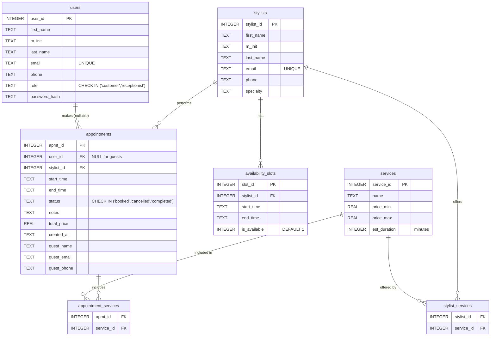
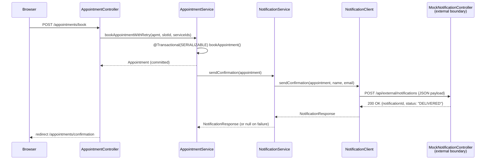

# Beautiful Nail - Online Appointment Scheduling System
**CMPE 172 Term Project | Spring 2026**

---

## Table of Contents

1. [System Overview](#1-system-overview)
2. [Architecture Diagram](#2-architecture-diagram)
3. [Database Schema & Rationale](#3-database-schema--rationale)
4. [Concurrency & Transaction Design](#4-concurrency--transaction-design)
5. [Distribution Boundary Design](#5-distribution-boundary-design)
6. [System Management & Logging](#6-system-management--logging)
7. [Limitations & Future Improvements](#7-limitations--future-improvements)
8. [Repository Structure](#8-repository-structure)
9. [Running Locally](#9-running-locally)

---

## 1. System Overview

Beautiful Nail is a full-stack, server-rendered web application for managing nail salon appointments. It is built with **Java 17**, **Spring Boot 3.2.3**, and **SQLite**, accessed via raw JDBC with no ORM. The UI is rendered server-side using **Thymeleaf** templates.

### Primary Users

| Role | Capabilities |
|---|---|
| **Guest (unauthenticated)** | Browse services, view available slots, book appointments using inline contact details |
| **Customer (registered)** | All guest capabilities plus authenticated booking tied to an account, appointment history, self-service cancellation |
| **Receptionist** | Full dashboard: view all appointments, cancel on behalf of customers, add/delete services, and view live system stats |

### Core Functionalities

- **Service catalog:** 15 seeded services organized into rarity tiers (Common through Very Rare), each with a price range and estimated duration.
- **Stylist roster:** 7 stylists, each with specialty tags and service offerings tracked in the `stylist_services` join table. Availability is re-seeded on startup for the next 30 days.
- **Slot browser:** filterable grid of available time slots by date, stylist, and required services. When no slots match the current filters, the next 3 dates with availability are shown.
- **Booking flow:** three-screen process (select slot, fill details, confirm). Multiple services can be selected per booking. Double-booking is prevented via database-level locking (see §4).
- **Notification pipeline:** every successful booking triggers an HTTP POST to the external notification service, which returns a tracking ID. Failed deliveries are queued in memory and retried every 30 seconds with exponential backoff.
- **Health & metrics endpoints:** REST APIs for database connectivity status, notification service health, booking throughput, latency percentiles, and failure breakdowns.

---

## 2. Architecture Diagram

```mermaid
graph TD
    Browser["Browser / Client"]

    subgraph "Spring Boot Application  :8080"
        direction TB

        subgraph "Controller Layer"
            HC["HomeController\n GET /"]
            AC["AvailabilityController\n GET /slots"]
            APC["AppointmentController\n GET|POST /appointments"]
            SVC["ServiceController\n GET /services"]
            RC["ReceptionistController\n GET|POST /receptionist"]
            AuthC["AuthController\n GET|POST /login, /register"]
            HLT["HealthController\n GET /health"]
            MET["MetricsController\n GET /metrics/**"]
            NOTIF_API["NotificationApiController\n GET /api/notifications/test"]
        end

        subgraph "Service Layer"
            ApS["AppointmentService\n @Transactional(SERIALIZABLE)\n bookAppointmentWithRetry()"]
            AvS["AvailabilityService\n getFilteredSlots()\n findNextAvailableDates()"]
            SCS["ServiceCatalogService"]
            US["UserService"]
            NS["NotificationService\n retry + backoff\n @Scheduled queue drain"]
            MC["MetricsCollector\n AtomicInteger counters\n latency samples"]
        end

        subgraph "Repository Layer  (raw JDBC)"
            AR["AppointmentRepository"]
            AVR["AvailabilityRepository\n markUnavailable() (optimistic lock)"]
            SR["ServiceRepository\n getStylistServiceMap()"]
            STR["StylistRepository"]
            UR["UserRepository"]
        end

        subgraph "Config / Startup"
            DSC["DataSourceConfig\n SQLite DataSource bean"]
            DMR["DatabaseMigrationRunner\n @Order(1): idempotent schema patches"]
            SEED["AvailabilitySeeder\n @Order(2): 30-day slot refresh"]
        end

        subgraph "Notification Boundary"
            NC["NotificationClient\n RestTemplate POST"]
            MOCK["MockNotificationController\n POST /api/external/notifications"]
        end

        subgraph "Thymeleaf Templates"
            TPL["index · slots · book\nconfirmation · services\nlogin · register\nreceptionist/dashboard"]
        end
    end

    DB[("SQLite\nbeautiful_nail.db")]

    Browser -->|HTTP| HC & AC & APC & SVC & RC & AuthC & HLT & MET & NOTIF_API
    HC & AC & APC & SVC & RC & AuthC --> TPL
    APC --> ApS
    AC --> AvS
    RC --> SCS & STR
    ApS --> NS & MC & AR & AVR
    AvS --> AVR
    SCS --> SR
    US --> UR
    NS --> NC
    NC -->|HTTP POST| MOCK
    AR & AVR & SR & STR & UR --> DB
    DSC --> DB
    DMR & SEED --> DB
```



### Request Flow

```
Browser -> Controller -> Service -> Repository -> SQLite
                   \ (on booking) NotificationService -> NotificationClient -> MockNotificationController
```

Session state (userId, userName, userRole, userEmail) is stored server-side in the HTTP session via `HttpSession`. There is no JWT or cookie-based token.

---

## 3. Database Schema & Rationale

The schema is built from eight incremental migration scripts (`db/migrations/V1__` through `V8__`) applied at startup by `DatabaseMigrationRunner`. All DDL operations in the runner are idempotent.

### Entity-Relationship Diagram



### Table-by-Table Rationale

#### `users`
Stores both customers and receptionists in a single table, differentiated by the `role` column (`CHECK` constraint enforces only `'customer'` or `'receptionist'`). This avoids a separate `receptionists` table since the identity fields are identical across roles. Passwords are stored as raw SHA-256 hex strings, which is sufficient for a course project but not for production (see §7).

#### `stylists`
Kept separate from `users` because stylists are salon staff, not system users. They do not log in and have no password. Merging them into `users` would require nullable columns and a wider role enum with no benefit.

#### `services`
Uses `price_min` / `price_max` (both `REAL`) instead of a single price because nail service pricing varies based on factors like length and design complexity. The `est_duration` integer (minutes) is available for slot validation, though duration conflict checks are not yet enforced at the database level.

#### `availability_slots`
The `is_available` flag is the core concurrency primitive. It starts as `1` and is atomically flipped to `0` during booking using a guarded `UPDATE ... WHERE is_available = 1` (see §4). Start/end times are stored as `TEXT` in ISO-8601 format (`YYYY-MM-DDTHH:mm:ss`), which SQLite's `date()` function handles natively in all date-filtered queries.

#### `appointments`
`user_id` is nullable to support guest bookings (V8 migration). Guest contact details (`guest_name`, `guest_email`, `guest_phone`) are stored directly on the row to avoid creating throwaway user accounts. The `status` column enforces valid values via a `CHECK` constraint.

#### `appointment_services` (join table)
Implements the M:N relationship between appointments and services. An appointment can include multiple services (e.g., Gel Manicure + Nail Art Add-on), and a service can appear in many appointments. Rows are inserted one-by-one in `AppointmentRepository.saveServices()` within the same transaction as the appointment insert.

#### `stylist_services` (join table)
Implements the M:N relationship between stylists and services, representing which services each stylist is qualified to perform. `AvailabilityRepository.findByDateAndStylistAndServices()` uses `INTERSECT` subqueries against this table to find stylists who can perform **all** requested services.

---

## 4. Concurrency & Transaction Design

### The Double-Booking Problem

When two users request the same slot simultaneously, both may read `is_available = 1` before either has written the booking. Without isolation, both transactions commit and the slot is double-booked.

### Defense-in-Depth Strategy

The system uses two mechanisms together:

#### Layer 1: SERIALIZABLE Transaction Isolation

`AppointmentService.bookAppointment()` is annotated with:

```java
@Transactional(isolation = Isolation.SERIALIZABLE)
```

`SERIALIZABLE` is the strictest JDBC isolation level. If two transactions attempt to read and write the same row concurrently, one will fail with a `DataAccessException` (SQLite raises `SQLITE_BUSY` or `SQLITE_LOCKED`), preventing phantom reads at the database level.

#### Layer 2: Optimistic Write Guard

The repository also uses a guarded `UPDATE` as a fallback:

```sql
UPDATE availability_slots
   SET is_available = 0
 WHERE slot_id = ?
   AND is_available = 1
```

`jdbc.update()` returns the number of affected rows. If `0` rows were updated, another transaction claimed the slot first. The service throws `IllegalStateException` and the transaction rolls back.

This is optimistic concurrency control: the row is not locked on read, but the write validates that the expected state still holds.

#### Layer 3: Retry Wrapper with Categorized Failure Tracking

`bookAppointmentWithRetry()` wraps `bookAppointment()` in a loop of up to 3 attempts:

```
Attempt 1 --> IllegalStateException (slot taken) --> log WARN, retry
Attempt 2 --> DataAccessException  (SQLITE_BUSY)  --> log WARN, retry
Attempt 3 --> failure              --> recordBookingFailure(reason), log ERROR, re-throw
```

Failure reasons (`"slot_unavailable"`, `"database_locked"`) are recorded in `MetricsCollector`. End-to-end latency is recorded on both success and final failure.

### Transaction Boundary for Booking

The full atomic unit of work inside `bookAppointment()`:

1. `availabilityRepo.findById(slotId)` - read slot
2. Check `slot.isAvailable()` - application-level guard
3. `appointmentRepo.save(appointment)` - insert appointment row, get generated PK
4. `appointmentRepo.saveServices(apmtId, serviceIds)` - insert join rows
5. `availabilityRepo.markUnavailable(slotId)` - guarded UPDATE, check affected rows
6. `notificationService.sendConfirmation(appointment)` - runs after commit

If any step from 1-5 throws, Spring rolls back the entire transaction. Step 6 runs after the commit, so a notification failure does not roll back the booking.

### Cancellation

```java
@Transactional
public void cancelAppointment(Long appointmentId, Long slotId) {
    appointmentRepo.updateStatus(appointmentId, "cancelled");
    availabilityRepo.markAvailable(slotId);
}
```

Cancellation restores `is_available = 1` atomically with the status update. Default `@Transactional` isolation is sufficient since cancellations are not contested.

---

## 5. Distribution Boundary Design

### Boundary Overview

The system has one explicit distribution boundary: the **Appointment Scheduler** calls the **Notification Service** over HTTP after a successful booking.



### Interface Design: Coarse-Grained Contract

The `NotificationClient` sends a **single, self-contained POST** containing:

```json
{
  "type"    : "BOOKING_CONFIRMATION",
  "channel" : "EMAIL",
  "recipient": { "name": "...", "email": "...", "phone": null },
  "appointment": {
      "appointmentId": 7,
      "startTime"    : "2026-05-10T10:00:00",
      "endTime"      : "2026-05-10T10:45:00",
      "totalPrice"   : 75.00,
      "notes"        : "..."
  }
}
```

The interface is **coarse-grained**: the notification service receives everything it needs in one call and never queries back into the Scheduler's database. This keeps the two services decoupled.

### Resilience Patterns in `NotificationService`

| Pattern | Implementation |
|---|---|
| **Retry with exponential backoff** | Up to 3 attempts; backoff delays of 1s, 2s, 4s between retries |
| **Graceful degradation** | On total failure, the appointment is committed and the notification is queued. The booking is not rolled back due to a notification failure. |
| **In-memory retry queue** | `ConcurrentLinkedQueue<QueuedNotification>` holds failed notifications |
| **Scheduled drain** | `@Scheduled(fixedDelay = 30000)` processes the queue every 30 seconds |
| **TTL eviction** | Notifications older than 24 hours are discarded from the queue |
| **Degradation signal** | `isServiceDegraded()` returns `true` if queue depth > 5; reported via `/health` |

### Mock vs. Production

`MockNotificationController` is co-hosted in the same Spring Boot process at `/api/external/notifications` and configured via:

```properties
notification.service.url=http://localhost:8080/api/external/notifications
```

In production, replace this URL with a real provider endpoint (SendGrid, Twilio, etc.) and remove the mock controller. `NotificationClient` and `NotificationService` need no code changes; only the configuration property changes.

### Domain Boundaries Within the Scheduler

Internal domain separation follows a layering rule:

| Layer | Dependency rule |
|---|---|
| `controller/` | May call `service/` only. Never calls `repository/` directly. |
| `service/` | May call `repository/` and other services. Never references HTTP types. |
| `repository/` | May call `JdbcTemplate` only. Never calls services. |
| `notification/` | Isolated sub-package. Called by `NotificationService`; never calls back into the main domain. |

---

## 6. System Management & Logging

### Logging Framework

The application uses **SLF4J** with the **Logback** backend (bundled with Spring Boot). Loggers are created per-class using `LoggerFactory.getLogger(ClassName.class)`.

#### Log Level Strategy

| Level | Used for |
|---|---|
| `DEBUG` | JDBC query execution (via `logging.level.org.springframework.jdbc=DEBUG`), retry queue drain details |
| `INFO` | Every booking attempt, slot fetches with parameters, successful outcomes, startup seeding counts |
| `WARN` | Slot contention (concurrent booking), individual notification retry failures, queue growth |
| `ERROR` | Final booking failure after all retries exhausted, database connectivity failure in health check |

#### Log Output Configuration (`application.properties`)

```properties
logging.level.com.beautifulnail=INFO
logging.level.org.springframework.jdbc=DEBUG
logging.file.name=logs/application.log
logging.file.max-size=10MB
logging.file.max-history=10
logging.pattern.console=%d{yyyy-MM-dd HH:mm:ss} [%thread] %-5level %logger{36} - %msg%n
logging.pattern.file=%d{yyyy-MM-dd HH:mm:ss} [%thread] %-5level %logger{36} - %msg%n
```

Log files roll at 10 MB with the 10 most recent files retained. The pattern includes timestamp, thread, level, abbreviated logger name, and message.

### Health Check Endpoint

`GET /health` returns HTTP 200 or 503 with a JSON body:

```json
{
  "status"    : "UP | DEGRADED | DOWN",
  "timestamp" : "2026-05-08T10:00:00Z",
  "checks": {
    "database"             : { "status": "UP",   "message": "SQLite connected" },
    "notification_service" : { "status": "UP",   "message": "External notification service responding" }
  }
}
```

**Status semantics:**

| Overall | Meaning | HTTP |
|---|---|---|
| `UP` | All components healthy | 200 |
| `DEGRADED` | Database UP, notification queue non-empty but below threshold | 200 |
| `DOWN` | Database unreachable, cannot serve requests | 503 |

Database health is checked via `SELECT 1`. Notification health is derived from `NotificationService.isServiceDegraded()` (queue depth > 5) and `getFailedNotificationsCount()`.

### Metrics Endpoints

`MetricsCollector` is a thread-safe in-memory store using `AtomicInteger`, `AtomicLong`, and `Collections.synchronizedList`. It is updated inline during every booking attempt.

| Endpoint | Description |
|---|---|
| `GET /metrics` | Full snapshot: all fields below |
| `GET /metrics/bookings` | `bookings_this_hour`, `failed_bookings`, `failure_rate_percent`, `failure_reasons` |
| `GET /metrics/bookings/latency` | `avg_latency_ms`, `p99_latency_ms`, `min_latency_ms`, `max_latency_ms`, `sample_count` |
| `GET /metrics/bookings/failed` | `total_failures`, `failure_rate_percent`, `failures_by_reason` |

**Latency tracking:** End-to-end duration of `bookAppointmentWithRetry()` is measured with `System.currentTimeMillis()`. The last 1,000 samples are kept (older samples are evicted from the front of the list). P99 is computed by sorting the sample list and indexing at `ceil(n * 0.99) - 1`.

**Hourly counter reset:** `bookingsThisHour` is reset to zero if 60 minutes have elapsed since the last reset, checked lazily on each read.

### Startup Lifecycle

On every application start, two `ApplicationRunner` beans execute in order:

1. **`DatabaseMigrationRunner` (`@Order(1)`)** - Applies the V8 guest-booking schema patch if not already present. Also corrects any seed accounts with legacy placeholder password hashes. All operations are idempotent.
2. **`AvailabilitySeeder` (`@Order(2)`)** - Deletes all existing availability slots and bulk-inserts a fresh 30-day rolling window using `jdbc.batchUpdate()`. Availability data is always current regardless of when the application was last started.

---

## 7. Limitations & Future Improvements

### Current Technical Debt & Limitations

#### Security
- **Plaintext-equivalent password hashing.** SHA-256 without a salt is vulnerable to rainbow table attacks. Production systems must use bcrypt, scrypt, or Argon2 via Spring Security's `PasswordEncoder`.
- **No CSRF protection.** All `POST` forms lack CSRF tokens. Spring Security would add these automatically.
- **No input sanitization.** `notes`, `guestName`, and similar user-supplied fields are passed to SQL via parameterized queries (safe against injection) but are rendered unescaped in some contexts.
- **Session-only auth.** There is no "remember me" functionality, token-based auth, or session expiry configuration.

#### Database
- **SQLite is single-writer.** SQLite serializes all writes to the file. Under concurrent load this becomes a throughput bottleneck. A production deployment would use PostgreSQL or MySQL, which support concurrent writes and row-level locking.
- **No connection pooling.** `DriverManagerDataSource` opens a new JDBC connection for every operation. Under load this is expensive. A HikariCP pool should be configured.
- **Timestamps stored as TEXT.** SQLite has no native `DATETIME` type; ISO-8601 strings are used. Timezone handling is entirely the application's responsibility. A migration to `TIMESTAMP WITH TIME ZONE` on PostgreSQL would be needed for multi-timezone use.
- **No soft-delete pattern.** Stylists and services are hard-deleted. Deleting a stylist with historical appointments would corrupt foreign key references if `ON DELETE RESTRICT` is not enforced (SQLite does not enforce FK constraints unless `PRAGMA foreign_keys = ON` is set per connection).

#### Notification System
- **Stubbed recipient identity.** `NotificationService.sendConfirmation()` uses hardcoded `"Valued Customer"` and `"customer@example.com"` instead of resolving the actual customer's name and email from the database. This must be wired to `UserRepository` for production use.
- **In-memory retry queue.** The `ConcurrentLinkedQueue` is lost on application restart. A persistent queue (Redis, a database-backed table, or a message broker like RabbitMQ) is required in production.
- **No delivery status tracking.** There is no database record of notification attempts, delivery status, or retry history.

#### Application
- **No pagination.** The appointments list and receptionist dashboard fetch all rows with `SELECT *`. This will degrade as data volume grows.
- **No role-based access control framework.** Authorization is implemented as `if (!isReceptionist(session)) return "redirect:/"` guards in each controller method. Spring Security's method-level security would be more robust and centralized.
- **Duration conflict not enforced.** The slot filter finds stylists who offer all requested services but does not validate whether the sum of service durations fits within the slot's time window.
- **`AvailabilitySeeder` is destructive on startup.** Deleting and rebuilding all slots on every restart means any manually-added slots (via the receptionist's "Add Slot" form) are lost on the next restart.

### Recommended Next Steps

| Priority | Improvement |
|---|---|
| High | Replace SHA-256 with bcrypt via Spring Security |
| High | Add HikariCP connection pool |
| High | Migrate to PostgreSQL for production |
| High | Wire real customer email into `NotificationService` |
| Medium | Persist notification retry queue to the database |
| Medium | Add Spring Security for CSRF, session management, and method-level authorization |
| Medium | Implement pagination on all list endpoints |
| Medium | Add service duration validation against slot window length |
| Low | Add Flyway or Liquibase for formal, tracked schema migrations |
| Low | Make `AvailabilitySeeder` additive (skip days that already have slots) |
| Low | Add appointment reschedule flow (currently only cancel is supported) |
| Low | Add admin UI for managing stylists (currently no add/edit stylist form) |

---

## 8. Repository Structure

```
beautiful-nail-scheduler/
├── pom.xml                          # Maven build config (Java 17, Spring Boot 3.2.3)
├── README.md
│
├── src/main/java/com/beautifulnail/scheduler/
│   ├── controller/
│   │   ├── HomeController.java          # GET /
│   │   ├── AvailabilityController.java  # GET /slots  (filter by date, stylist, services)
│   │   ├── AppointmentController.java   # GET|POST /appointments/**
│   │   ├── ServiceController.java       # GET /services
│   │   ├── AuthController.java          # GET|POST /login, /register, /logout
│   │   ├── ReceptionistController.java  # GET|POST /receptionist/**
│   │   ├── HealthController.java        # GET /health
│   │   ├── MetricsController.java       # GET /metrics/**
│   │   └── NotificationApiController.java
│   ├── service/
│   │   ├── AppointmentService.java      # Booking logic, @Transactional(SERIALIZABLE)
│   │   ├── AvailabilityService.java     # Slot queries, next-available-date search
│   │   ├── ServiceCatalogService.java   # Service CRUD
│   │   ├── UserService.java             # Auth, registration
│   │   ├── NotificationService.java     # Retry, backoff, queue drain (@Scheduled)
│   │   └── MetricsCollector.java        # In-memory metrics (atomic counters, latency)
│   ├── repository/                      # Raw JDBC, one repository per entity
│   │   ├── AppointmentRepository.java
│   │   ├── AvailabilityRepository.java  # markUnavailable() optimistic lock
│   │   ├── ServiceRepository.java       # getStylistServiceMap() for slot filter
│   │   ├── StylistRepository.java
│   │   └── UserRepository.java
│   ├── model/                           # POJOs mapping to DB rows
│   │   ├── Appointment.java
│   │   ├── Availability.java
│   │   ├── Service.java
│   │   ├── Stylist.java
│   │   └── User.java
│   ├── config/
│   │   ├── DataSourceConfig.java        # SQLite DataSource + JdbcTemplate + RestTemplate beans
│   │   ├── DatabaseMigrationRunner.java # @Order(1) startup: idempotent schema patches
│   │   └── AvailabilitySeeder.java      # @Order(2) startup: 30-day slot refresh
│   └── notification/
│       ├── NotificationClient.java      # RestTemplate wrapper, crosses distribution boundary
│       ├── MockNotificationController.java  # Simulated external notification service
│       └── dto/
│           ├── NotificationRequest.java
│           └── NotificationResponse.java
│
├── src/main/resources/
│   ├── application.properties           # Port, SQLite URL, logging, notification URL
│   ├── templates/                       # Thymeleaf server-rendered HTML
│   │   ├── fragments/nav.html
│   │   ├── index.html
│   │   ├── slots/index.html
│   │   ├── appointments/book.html
│   │   ├── appointments/list.html
│   │   ├── appointments/confirmation.html
│   │   ├── services/index.html
│   │   ├── auth/login.html
│   │   ├── auth/register.html
│   │   └── receptionist/dashboard.html
│   └── static/css/style.css
│
├── db/
│   ├── migrations/                      # V1-V8 SQL schema scripts
│   └── seeds/seed_data.sql              # 3 users, 7 stylists, 15 services, stylist->service mappings
│
├── docs/
│   ├── milestones/                      # M1-M6 milestone submissions
│   └── diagrams/                        # ER, distribution, request-flow, wireframes
│
└── scripts/
    └── init_db.ps1                      # PowerShell script for DB initialization
```

---

## 9. Running Locally

### Prerequisites

- Java 17+
- Maven 3.9+
- No external database required. SQLite file is created automatically at `db/beautiful_nail.db`

### Steps

```bash
# 1. Clone the repository
git clone https://github.com/<your-org>/beautiful-nail.git
cd beautiful-nail

# 2. Initialize the database (run migrations + seed data)
#    On Windows PowerShell:
./scripts/init_db.ps1

# 3. Build and run
mvn spring-boot:run

# 4. Open in browser
#    http://localhost:8080
```

### Seed Accounts

| Email | Password | Role |
|---|---|---|
| `jane.doe@example.com` | `password` | customer |
| `mike.smith@example.com` | `password` | customer |
| `linda.r@beautifulnail.com` | `password` | receptionist |

### Key Endpoints

| URL | Description |
|---|---|
| `http://localhost:8080/` | Home page |
| `http://localhost:8080/slots` | Browse available appointment slots |
| `http://localhost:8080/services` | Service catalog with pricing |
| `http://localhost:8080/login` | Customer login |
| `http://localhost:8080/receptionist` | Receptionist dashboard (requires login) |
| `http://localhost:8080/health` | System health check (JSON) |
| `http://localhost:8080/metrics` | Live metrics snapshot (JSON) |
